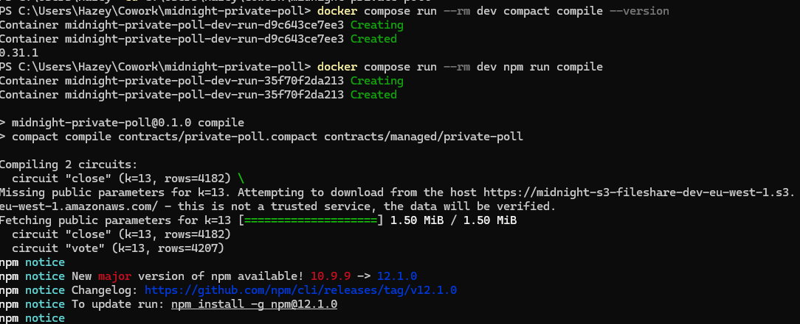
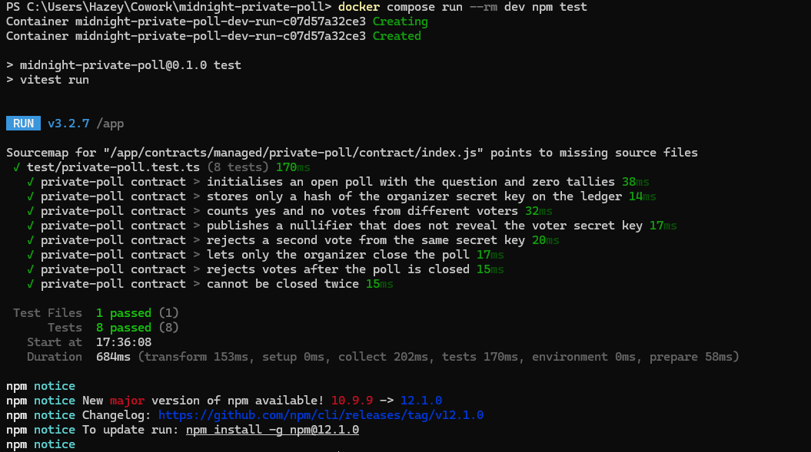

# Midnight Private Poll

> Anonymous yes/no polls on Midnight: the question and tally are public, voter identity stays private, and double voting is blocked by zero-knowledge proofs.

*Rise In × Midnight Builder Challenge: New Moon, Level 1 submission.*

## Contract Address

| Network  | Address                          |
|----------|----------------------------------|
| Preview  | `f579175eed48416ad5b6b72fc3168cc4046fd36fe2be5a5b92dc6be22d6be4dd` |
| Preprod  | Not deployed yet (Preview deployment above) |

Deployed with Compact toolchain 0.31.1, proof server 8.1.0, Midnight.js 4.1.1 and wallet-sdk 1.2.0, following the [support matrix](https://docs.midnight.network/relnotes/support-matrix).

## What This Does

Private Poll is a smart contract for running a yes/no poll where **everyone can see the result, but nobody can see who voted**.

1. An **organizer** deploys the contract with a question, e.g. *"Should Midnight dApps default to private-by-design?"*. The poll starts `OPEN`.
2. Any **voter** calls `vote(yes | no)`. Their wallet runs the ZK circuit locally with the voter's secret key and sends only a proof, a one-way *nullifier*, and a +1 to the chosen tally.
3. A second vote from the same secret key produces the same nullifier and is **rejected**.
4. The organizer calls `close()` and proves in zero knowledge that they hold the organizer key. After that, no more votes are accepted.

Contract source: [`contracts/private-poll.compact`](contracts/private-poll.compact)

## Privacy Model

Midnight contracts separate **public ledger state** (on-chain, readable by anyone) from **private witnesses** (data supplied from the user's own machine, used inside the ZK circuit and never sent to the network). Compact treats everything derived from a witness or circuit argument as private by default. It refuses to compile if that data could reach the ledger unless you wrap it in `disclose()`, so every disclosure below is a deliberate, visible line in the source.

### What is PUBLIC (on-chain, visible to anyone)

| Ledger field | Type | Why it is public |
|---|---|---|
| `question` | `Opaque<"string">` | Everyone needs to know what they are voting on. |
| `state` | `PollState` (`OPEN` / `CLOSED`) | Voters and observers must know whether voting is allowed. |
| `yesVotes`, `noVotes` | `Counter` | The point of the poll: a publicly verifiable tally. |
| `organizer` | `Bytes<32>` | A **hash** of the organizer's secret key, never the key itself. |
| `nullifiers` | `Set<Bytes<32>>` | One entry per ballot: a one-way hash of the voter's secret key, used to reject double votes. |

### What is PRIVATE (private witness, never on-chain)

```compact
witness localSecretKey(): Bytes<32>;
```

- The **voter's / organizer's 32-byte secret key**. It is implemented in [`src/witnesses.ts`](src/witnesses.ts) and read from local private state: an encrypted LevelDB store for real deployments, memory for tests.
- Proofs are generated by a **proof server running locally in Docker**, so the key never leaves the machine. It is not sent to the chain, the indexer, or any remote service.
- There is **no link between a ballot and a wallet or identity**. A nullifier is a domain-separated `persistentHash` of the key and can't be reversed.

### What the user PROVES without revealing

| Circuit | The user proves… | …without revealing |
|---|---|---|
| `vote` | "I know a secret key whose nullifier is not yet in `nullifiers`," i.e. I haven't voted yet | the secret key, or which earlier (or later) ballots are theirs |
| `close` | "I know the secret key whose `organizerKey` hash is stored on the ledger," i.e. I am the organizer | the organizer's secret key (the comparison happens inside the circuit) |

### Where `disclose()` is used, and why

| Location | What is disclosed | Why that is safe / intended |
|---|---|---|
| `constructor` | `disclose(pollQuestion)` | The question is meant to be public. |
| `constructor` | `disclose(organizerKey(localSecretKey()))` | Only a domain-separated hash of the key is published. The key itself can't be recovered. |
| `vote` | `disclose(nullifier(localSecretKey()))` | A *different* domain-separated hash. It can't be linked to the key, the organizer hash or a wallet, but it is deterministic, so repeat votes are caught. |
| `vote` | `disclose(choice)` | The choice decides which public counter increments, so it becomes public by necessity. **Who** chose it stays private. |

> **Honest limitations (Level 1 scope):** there's no voter-eligibility check yet, so anyone with a fresh key can vote (Sybil). The fix is Merkle-tree membership, described in the Initial Idea below. Transaction fees are paid by a wallet, so voters should use a fresh fee wallet for full unlinkability.

## Tech Stack

- **Midnight network**: deployed to the Preview testnet (scripts also support Preprod)
- **Compact language**: compiler/toolchain 0.31.1 (`pragma language_version >= 0.23`), compiled to ZK circuits
- **Node.js v22**: deploy scripts and tests in TypeScript (`tsx`, `vitest`)
- **Docker**: runs the toolchain container (Node 22 + Compact) and the Midnight proof server 8.1.0
- **Midnight SDKs**: `@midnight-ntwrk/compact-runtime` 0.16.0, Midnight.js 4.1.1, wallet-sdk 1.2.0

## Prerequisites

Compact ships for Linux and macOS only. So that this project runs the same on **Windows, macOS and Linux**, the whole toolchain runs in Docker. You need:

- **Docker Desktop** (with Docker Compose v2), running
- **Git**
- For deploying: a wallet funded from the [Preview faucet](https://midnight-tmnight-preview.nethermind.dev) or the [Preprod faucet](https://midnight-tmnight-preprod.nethermind.dev). The deploy script generates the wallet and prints its address.

Node.js 22 and the Compact compiler are **inside the `dev` container** built from [`Dockerfile.dev`](Dockerfile.dev), so you don't need to install them on the host. For a native Linux / macOS / WSL setup instead, see below.

<details>
<summary>Native install (Linux / macOS / WSL)</summary>

```bash
curl --proto '=https' --tlsv1.2 -LsSf https://github.com/midnightntwrk/compact/releases/latest/download/compact-installer.sh | sh
compact update 0.31.1
nvm install 22 && nvm use 22
npm install
docker run -p 6300:6300 midnightntwrk/proof-server:8.1.0 midnight-proof-server -v
```

Then drop the `docker compose run --rm dev` prefix from the commands below.
</details>

## Setup

```bash
# 1. Clone
git clone https://github.com/hazeyxd23/midnight-private-poll.git
cd midnight-private-poll

# 2. Build the toolchain image (Node 22 + Compact devtools, compiler pinned to 0.31.1)
docker compose build dev

# 3. Install JS dependencies (inside the container)
docker compose run --rm dev npm install

# 4. Verify the toolchain
docker compose run --rm dev compact compile --version    # -> 0.31.1
docker compose run --rm dev node --version               # -> v22.x

# 5. Compile the contract to ZK circuits (writes managed/private-poll/)
docker compose run --rm dev npm run compile
```

`compact compile` generates `managed/private-poll/`:

| Folder | Contents |
|---|---|
| `contract/` | JS/TS bindings (`index.js`, `index.d.ts`) |
| `keys/` | prover + verifier keys for each circuit (`vote`, `close`) |
| `zkir/` | ZK intermediate representation for each circuit |
| `compiler/` | `contract-info.json` |

### Deploy to Preview (or Preprod)

```bash
# 1. Start the local proof server (ZK proofs are generated on your machine)
docker compose up -d proof-server

# 2. Deploy. On first run a new wallet is generated and its address printed
docker compose run --rm dev npm run deploy:preview     # Preview testnet
docker compose run --rm dev npm run deploy             # Preprod testnet

# 3. Read the deployed poll's public ledger state (no wallet needed)
docker compose run --rm dev npm run status:preview     # or: npm run status (Preprod)
```

On first run the script prints a wallet address (`mn_addr_preview1…` / `mn_addr_preprod1…`) and waits. Fund that address from the matching faucet ([Preview](https://midnight-tmnight-preview.nethermind.dev), [Preprod](https://midnight-tmnight-preprod.nethermind.dev)). The script then registers the NIGHT for DUST (the fee resource), generates the deploy proof locally, and prints the **contract address**.

The wallet seed and recovery phrase are saved to `.midnight-state.json`, which is git-ignored. Optionally set `POLL_QUESTION` and `PRIVATE_STATE_PASSWORD` (16+ chars) in a git-ignored `.env.preprod`.

## Run Tests

```bash
docker compose run --rm dev npm test
```

[`tests/private-poll.test.ts`](tests/private-poll.test.ts) runs 8 tests against an in-memory simulator ([`tests/poll-simulator.ts`](tests/poll-simulator.ts)) built on `@midnight-ntwrk/compact-runtime`. It needs no network and no proof server.

| Area | Tests |
|---|---|
| **Circuit logic** | yes/no votes from different voters are counted correctly; double voting with the same key is rejected |
| **State transitions** | poll starts `OPEN` with zero tallies; only the organizer can move it to `CLOSED`; voting after close is rejected; a closed poll can't be closed again |
| **Private inputs never exposed** | only a hash of the organizer key is on the ledger; the published nullifier is not the voter's secret key |

The same tests run on every push via GitHub Actions ([`.github/workflows/ci.yml`](.github/workflows/ci.yml)).

## Initial Idea

**Private Poll** lets communities, DAOs, classrooms and companies run votes where the *result* is public and verifiable but the *voters* stay anonymous. Today, on-chain voting is fully transparent: every wallet's choice is public forever, which invites pressure, vote buying and retaliation. Off-chain anonymous tools ask you to trust whoever runs the server. On Midnight, each voter holds a secret key that never leaves their device. They prove in zero knowledge that they have not voted before, and the chain only sees a one-way *nullifier* plus a +1 on the tally. The next step is eligibility: the organizer publishes a Merkle root of allowed voter commitments, and voters prove membership without revealing which member they are. That gives one-person-one-vote, private ballots, and a publicly auditable count.

## Screenshots

**Successful compile (circuits `close` and `vote` listed)**



**Test suite passing (8/8)**



**Contract deployed to Preview (address shown)**


## Project Structure

```
contracts/
  private-poll.compact          # the Compact contract
managed/
  private-poll/                 # generated by `compact compile` (committed)
src/
  witnesses.ts                  # private state type + witness implementation
  deploy.ts                     # deploy to Preview/Preprod (wallet, DUST, proof server, deploy)
  status.ts                     # read the public ledger state from the indexer
  network.ts, wallet*.ts        # network config + wallet SDK glue (from create-mn-app)
  check-balance.ts              # tNIGHT / DUST balance of the deploy wallet
tests/
  poll-simulator.ts             # in-memory contract simulator
  private-poll.test.ts          # vitest suite
.github/workflows/ci.yml        # compile + test on every push
Dockerfile.dev                  # Node 22 + Compact 0.31.1 toolchain image
docker-compose.yml              # `dev` toolchain container + local proof server
docs/screenshots/               # compile, test and deploy screenshots
```

## License

MIT
